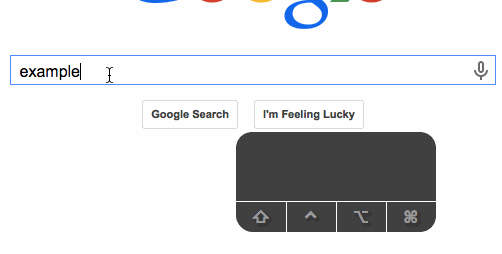

Peniquitous
===========

A user script that provides Ctrl-P & Ctrl-N support for search field drop-down
lists.

When search fields offer a list of suggestions, they often support using the up
& down keys to choose a suggestion. This user script works by simulating the up
& down arrow keys when you press Ctrl-P & Ctrl-N.

Using these new key combinations, you can save a couple seconds moving your
hand to the arrow keys or take advantage of the muscle memory instilled from
GNU Readline, Emacs, and other console applications.

## Demo

## Install
Open the [raw script][1] and click “Install” in the resulting dialog. A [more
detailed explanation][2] is available on the Greasemonkey wiki.

## License
Copyright © 2015, 2021 Teddy Wing. Licensed under the GNU GPLv3+ (see the
included COPYING file).

[1]: https://raw.githubusercontent.com/teddywing/Peniquitous/master/peniquitous.user.js
[2]: https://wiki.greasespot.net/Greasemonkey_Manual:Installing_Scripts
